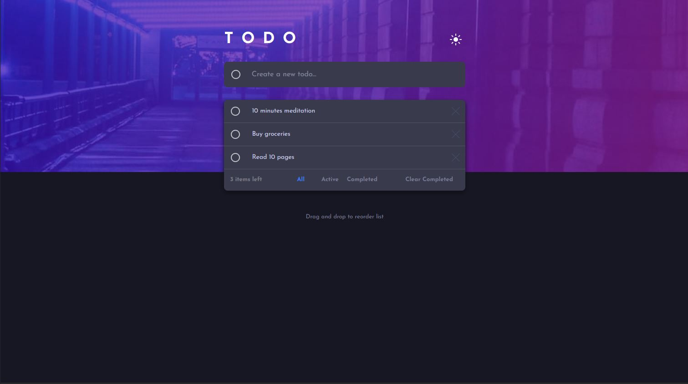

## Table of contents

- [Overview](#overview)
- [Screenshot](#screenshot)
- [Links](#links)
- [My process](#my-process)
- [Built with](#built-with)
- [What I learned](#what-i-learned)
- [Useful resources](#useful-resources)
- [Author](#author)

## Overview
This app provides the basic functionality to manage your daily to-do tasks with a user-friendly UI along with light and dark modes.

### Screenshot



### Links

- Solution URL: [Todo-solution](https://github.com/gharewal12/todo-app)
- Live Site URL: [Todo-Live-Url](https://gharewal12.github.io/todo-app/)

## My process
- Created a react app using
```node
 npm create-react-app
```
- Installed Material UI package
```node
  npm install @mui/material @emotion/react @emotion/styled
```
- Installed Drag and Drop package
```node
  npm install react-dnd
  npm install react-dnd-html5-backend
  npm install react-dnd-multi-backend /*To achieve drag and drop in mobile view*/
```
### Built with

- Semantic HTML5 markup
- CSS custom properties
- [React](https://reactjs.org/) - React JS library
- [Typescript](https://www.typescriptlang.org/) - Typescript library
- [Material UI Components](https://mui.com/) - For styles
- [Drag and Drop](https://www.npmjs.com/package/react-dnd-multi-backend) - For Drag and Drop functionality
- GitHub pages for deployment


### What I learned

### CSS
- Linear Gradient Coloring
```css
  background: 'linear-gradient(135deg, hsl(192, 100%, 67%), hsl(280, 87%, 65%))'
```
- Strikethrough text
```css
  textDecorationLine: 'line-through'
```
- Background Image properties
 ```css
  backgroundImage: `url(${mode === "light" ? BgWhite : BgDark})`,
  backgroundRepeat: 'no-repeat',
  backgroundSize: 'cover',
  backgroundPositionX: mobileView ? '25%' : ''
```
### MUI
- Use of MainTheme.ts to provide a default theme for the whole application.
  
### Javascript

- UseCallback
  - To memoize the function call, which only changes when there is a change in the value of dependency, improving the performance.
```js
  useCallback(() =>{<callback function>},[dependencyList]};
```
- Event listener - Resize
  - To capture the window width on resizing
```js
 window.addEventListener('resize', handleResize);
```

### Useful resources

- [Chat GPT](https://chat.openai.com/) - This helped me understand the drag-and-drop functionality logic.

## Author

- Frontend Mentor - [@gharewal12](https://www.frontendmentor.io/profile/gharewal12)
<p align="left">
  <a href="https://www.linkedin.com/in/granth-gharewal" target="_blank" rel="noreferrer"></a>
</p>
